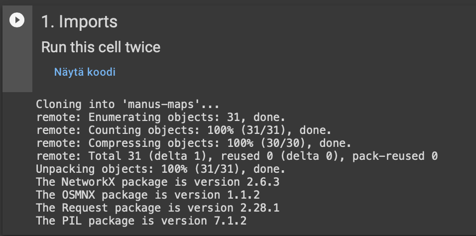
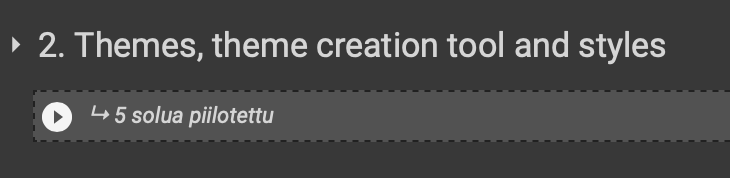
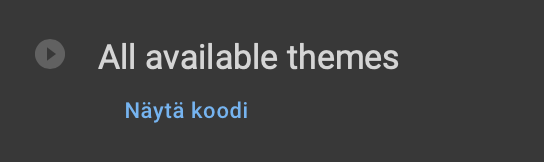
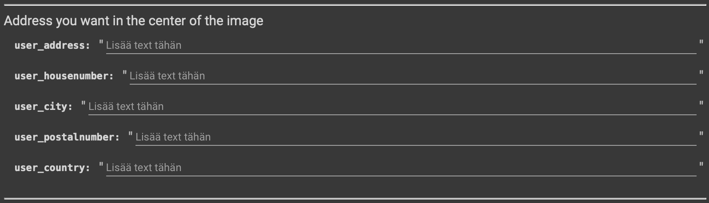
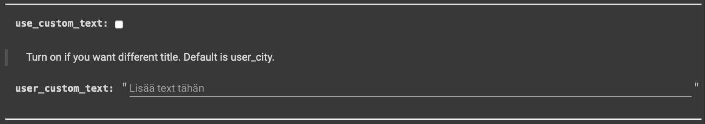
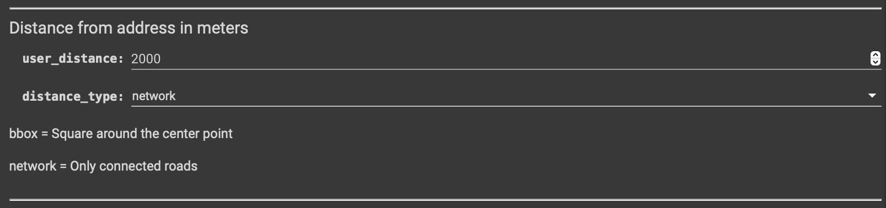
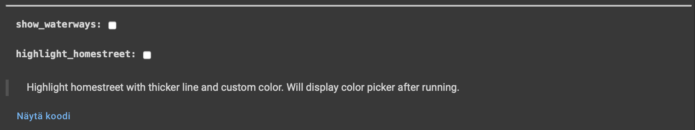
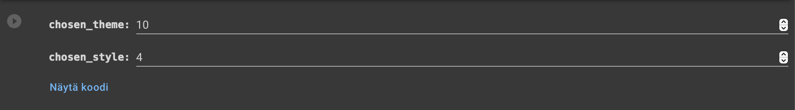
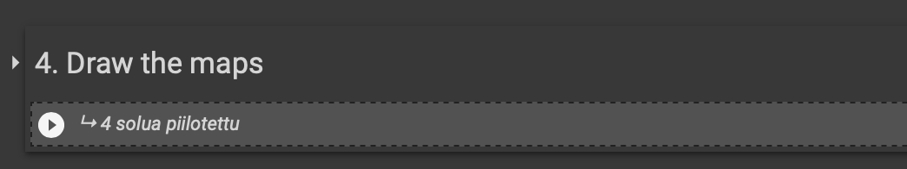
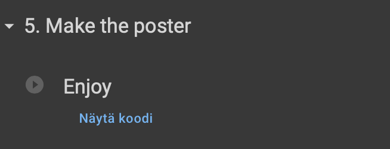

<!-- PROJECT SHIELDS -->
<!--
*** I'm using markdown "reference style" links for readability.
*** Reference links are enclosed in brackets [ ] instead of parentheses ( ).
*** See the bottom of this document for the declaration of the reference variables
*** for contributors-url, forks-url, etc. This is an optional, concise syntax you may use.
*** https://www.markdownguide.org/basic-syntax/#reference-style-links
-->
[![Contributors][contributors-shield]][contributors-url]
[![Forks][forks-shield]][forks-url]
[![Stargazers][stars-shield]][stars-url]
[![Issues][issues-shield]][issues-url]
[![MIT License][license-shield]][license-url]
[![LinkedIn][linkedin-shield]][linkedin-url]

<!-- PROJECT LOGO -->
 

  <!--  -->

<h3 align="center">manus-maps</h3>

  

    Colab notebook that creates print quality map posters from given address
     
    <a href="https://github.com/manukivela/manus-maps"><strong>Explore the docs »</strong></a>
     
     
    <a href="https://github.com/manukivela/manus-maps">View Demo</a>
    ·
    <a href="https://github.com/manukivela/manus-maps/issues">Report Bug</a>
    ·
    <a href="https://github.com/manukivela/manus-maps/issues">Request Feature</a>
  

<!-- TABLE OF CONTENTS -->

  
Table of Contents

  <ol>
    <li>
      <a href="#about-the-project">About The Project</a>
      <ul>
        <li><a href="#built-with">Built With</a></li>
      </ul>
    </li>
    <li>
      <a href="#getting-started">Getting Started</a>
      <ul>
        <li><a href="#prerequisites">Prerequisites</a></li>
        <li><a href="#installation">Installation</a></li>
      </ul>
    </li>
    <li><a href="#usage">Usage</a></li>
    <!-- <li><a href="#roadmap">Roadmap</a></li> -->
    <!-- <li><a href="#contributing">Contributing</a></li> -->
    <!-- <li><a href="#license">License</a></li> -->
    <li><a href="#contact">Contact</a></li>
    <!-- <li><a href="#acknowledgments">Acknowledgments</a></li> -->
  </ol>

<!-- ABOUT THE PROJECT -->
## About The Project

Easy to use notebook which creates print quality map posters. Multiple different styles and color schemes. 

Note that this is still very much a work in progress. Most of the color schemes are visually not so thought out and there really is only one "type" of poster. 

(<a href="#top">back to top</a>)

### Built With

* [Python](https://python.org/)

(<a href="#top">back to top</a>)

<!-- GETTING STARTED -->
## Getting Started

To run this in Google Colab:

### Prerequisites

* Google account

### Installation

>Click here and save copy to your drive: 

or

1. Download the .ipynb
   
2. Go to http://colab.research.google.com
   
3. Upload the .ipynb

4. Run the first cell twice

(<a href="#top">back to top</a>)

<!-- USAGE EXAMPLES -->
## Usage

1. Run the first cell, wait for it to finish and run it again. To run a cell, press the "play" symbol on the top left corner.

2. Run the second cell group by clicking the play symbol. The symbol will appear when you hover over the "hidden cells". If you want to add or edit themes, the dictionarys are hidden in this cell group.

3. Run this cell to display all available themes. It will display them under the cell after running.

4. This is where you enter the address you want to use as a center point. None of the fields are required, but I recommend you enter atleast address, city and country.

5. Turn on if you want to use your own title. If turned off, title will default to city.

6. Distance around the center point in meters. Two distance types. Network only draws connected roads (Jätkäsaari example) and bbox draws a square around the center (Pori example)

7. Turn on show_waterways if you want rivers and such to be drawn. Will not render lakes, seas or any other larger watermass. Highlighting the homestreet let's you pick a different color for the address you entered.

8. Here you choose the theme (color scheme) and the style (thickness of lines). These are not really thought out, so your mileage may vary. My favorites are Theme 1/Style 4 for distances < 2000 and Theme 4 / Style 1 for larger ones. Remember to **run the cell**!

9. Run this cell group to draw the maps. First run takes a while as it draws to roads and waterways. You can

10. Run the last cell to make the poster. If you're happy, right click to save. By default the poster is ready for A3 printing (300dpi)

(<a href="#top">back to top</a>)

<!-- ROADMAP -->
<!-- ## Roadmap

- [ ] Feature 1
- [ ] Feature 2
- [ ] Feature 3
    - [ ] Nested Feature

See the [open issues](https://github.com/manukivela/manus-maps/issues) for a full list of proposed features (and known issues).

(<a href="#top">back to top</a>)

 -->

<!-- CONTRIBUTING -->
<!-- ## Contributing

Contributions are what make the open source community such an amazing place to learn, inspire, and create. Any contributions you make are **greatly appreciated**.

If you have a suggestion that would make this better, please fork the repo and create a pull request. You can also simply open an issue with the tag "enhancement".
Don't forget to give the project a star! Thanks again!

1. Fork the Project
2. Create your Feature Branch (`git checkout -b feature/AmazingFeature`)
3. Commit your Changes (`git commit -m 'Add some AmazingFeature'`)
4. Push to the Branch (`git push origin feature/AmazingFeature`)
5. Open a Pull Request 

(<a href="#top">back to top</a>)
-->

<!-- LICENSE -->
<!-- ## License

Distributed under the MIT License. See `LICENSE.txt` for more information.

(<a href="#top">back to top</a>)

 -->

<!-- CONTACT -->
## Contact

Manu Kivelä -  manu.kivela@student.samk.fi

Project Link: [https://github.com/manukivela/manus-maps](https://github.com/manukivela/manus-maps)

(<a href="#top">back to top</a>)

<!-- ACKNOWLEDGMENTS -->
<!-- ## Acknowledgments

* 
* 
* 

(<a href="#top">back to top</a>)
 -->

<!-- MARKDOWN LINKS & IMAGES -->
<!-- https://www.markdownguide.org/basic-syntax/#reference-style-links -->
[contributors-shield]: https://img.shields.io/github/contributors/manukivela/manus-maps.svg?style=for-the-badge
[contributors-url]: https://github.com/manukivela/manus-maps/graphs/contributors
[forks-shield]: https://img.shields.io/github/forks/manukivela/manus-maps.svg?style=for-the-badge
[forks-url]: https://github.com/manukivela/manus-maps/network/members
[stars-shield]: https://img.shields.io/github/stars/manukivela/manus-maps.svg?style=for-the-badge
[stars-url]: https://github.com/manukivela/manus-maps/stargazers
[issues-shield]: https://img.shields.io/github/issues/manukivela/manus-maps.svg?style=for-the-badge
[issues-url]: https://github.com/manukivela/manus-maps/issues
[license-shield]: https://img.shields.io/github/license/manukivela/manus-maps.svg?style=for-the-badge
[license-url]: https://github.com/manukivela/manus-maps/blob/master/LICENSE.txt
[linkedin-shield]: https://img.shields.io/badge/-LinkedIn-black.svg?style=for-the-badge&logo=linkedin&colorB=555
[linkedin-url]: https://www.linkedin.com/in/manu-kivelä-a034301b9/
[product-screenshot]: screenshots/ss_game.png
[login-screenshot]: screenshots/ss_login.png
[menu-screenshot]: screenshots/ss_menu.png
[leaderboard-screenshot]: screenshots/ss_leaderboard.png